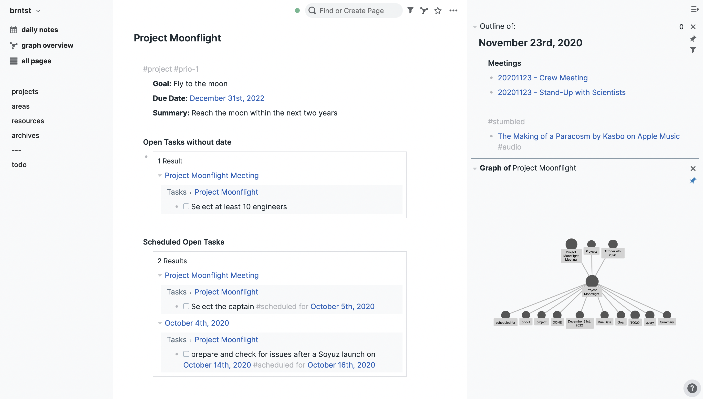

# roam_mnml

A minimal theme for Roam Research

Create the page roam/css with a css code block and enter @import url(https://rcvd.github.io/roam_mnml/site.css)

Fixed a lot of minor issues with jumping bullets. Cleaned up the layout and design a lot.

